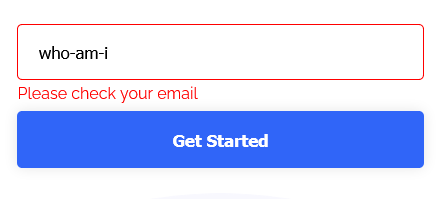

# Frontend Mentor - Fylo landing page with two column layout solution

This is a solution to the [Fylo landing page with two column layout challenge on Frontend Mentor](https://www.frontendmentor.io/challenges/fylo-landing-page-with-two-column-layout-5ca5ef041e82137ec91a50f5).

## Table of contents

- [Overview](#overview)
  - [The challenge](#the-challenge)
  - [Screenshot](#screenshot)
  - [Links](#links)
- [My process](#my-process)
  - [Built with](#built-with)
  - [What I learned](#what-i-learned)
  - [Continued development](#continued-development)
  - [Useful resources](#useful-resources)
- [Author](#author)
- [Acknowledgments](#acknowledgments)

## Overview

### The challenge

Users should be able to:

- View the optimal layout for the site depending on their device's screen size
- See hover states for all interactive elements on the page

### Screenshot


### Links

- Solution URL: [click here](https://github.com/ivan-f-sokolov/fylo-landing-page)
- Live Site URL: [click here](https://ivan-f-sokolov.github.io/fylo-landing-page/)

## My process

### Built with

- JavaScript
- SASS
- Pug

### What I learned

How to make a component on the example of a custom form validation. You can select a form with an input field and configure the settings. A confirmation message will appear under the input.



```js
import { CustomValidation } from "./modules/custom-validation.mjs";

const form = document.querySelector("form");

class customForm extends CustomValidation {
    constructor(form) {
        super(form);
        this.text = "Submitted successfully!";
        this.color = "white";
        this.textError = "Please check your email";
        this.colorError = "red";
    };
};

let formValidation = new customForm(form);

formValidation.render()
```

### Continued development

I would like to speed up the pace of work by using frameworks like Vue.js. It would also be nice to make a page based on the grid layout.

### Useful resources

- [css-tricks.com](https://css-tricks.com/snippets/css/a-guide-to-flexbox/) flexbox guide
- [MDN Web Docs](https://developer.mozilla.org/en-US/) has a lot of detailed info

## Author

- GitHub - [Ivan F. Sokolov](https://github.com/ivan-f-sokolov)

## Acknowledgments

Thanks to the youtube channel FlorinPop, I used [this video guide](https://www.youtube.com/watch?v=a9-Ro9rc7E4) for the challenge.
